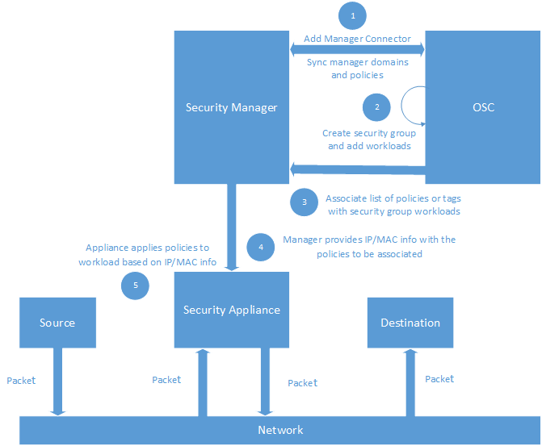

# Multi-Policy Mapping Workflow

This document describes the proposed changes for multi-policy mapping workflow.

## Background

Currently, we have two ways to determine which policy gets applied to which workload:

- Providing the VNF security manager with the encapsulation tag
- Providing the VNF security manager with the IP/Mac information and a list of polices/tags to be associated

If the manager is supporting [Policy Mapping](https://github.com/opensecuritycontroller/security-mgr-api/blob/master/src/main/java/org/osc/sdk/manager/Constants.java#L70) and [Security Group](https://github.com/opensecuritycontroller/security-mgr-api/blob/master/src/main/java/org/osc/sdk/manager/Constants.java#L60), we provide the manager with the security group name and members (their IPs and MACs) information to bind the policy.

**Policy mapping workflow**



OSC connects to the manager by adding a manager connector and syncs the domains and the policies avaiable with the manager. OSC as a part of binding process provides the security manager with IP/MAC information and the list of policies/tag to be associated with the workload. The security manager provides the supplied information to the security appliance. The security appliance applies the right policies to the workload based on the IP/MAC information.

## Constraints and Assumptions
The appliance security manager will not delete a security group with one or more security group interfaces.

## Design Changes
`SecurityGroup`: Currently, `SecurityGroup` and `SecurityGroupInterface` have many to many entity mapping. The proposed design will change this relationship to a one to many relationship between the SG and the SGIs.

### REST API

**API** to retrieve all the available Security Group Bindings to Security Function Service.

**GET** `/api/server/v1/virtualizationConnectors/{vcId}/securityGroups/{sgId}/bindings`

Now returns the list of policy id's associated with the binding along with additional details
```
"policyIds": []
```
**API** to Add/Update/Remove Security Group Bindings to Security Function Services.

**PUT** `/api/server/v1/virtualizationConnectors/{vcId}/securityGroups/{sgId}/bindings`

```
[
  {
    "virtualSystemId": 0,
    "name": "string",
    "policyIds": [
      0						// Provide comma seperated list of policy id's supported by security manager
    ],
    "policies": [
      {
        "id": 0,
        "parentId": 0,
        "policyName": "string",
        "mgrPolicyId": "string",
        "mgrDomainId": 0,
        "mgrDomainName": "string"
      }
    ],
    "multiplePoliciesSupported": false,
    "markedForDeletion": false,
    "failurePolicyType": "FAIL_OPEN",
    "order": 0,
    "binded": false
  }
]
```
### OSC SDKs

#### VNF Security Manager SDK

`SecurityGroupInterfaceElement`: Add a new interface

```java
public interface SecurityGroupInterfaceElement {

	/**
	 * @return the identifier of the security group interface defined by the manager
	 */
	String getManagerSecurityGroupInterfaceId();

	/**
	 * @return the name of the security group interface defined by OSC
	 */
	String getName();

	/**
	 * Provides the identifier of the security group defined by security managers that support policy mapping and
	 * security groups
	 *
	 * @return the identifier of the security group defined by the manager
	 */
	String getManagerSecurityGroupId();

	/**
	 * Provides the context information of manager policy element
	 *
	 * @return the set of manager policy elements
	 */
	Set<ManagerPolicyElement> getManagerPolicyElements();

	/**
	 * @return the encapsulation tag supported by the manager
	 */
	String getTag();
}
```


`ManagerSecurityGroupInterfaceApi`: Update `ManagerSecurityGroupInterfaceApi` interface

**Current interface methods**

```java
public interface ManagerSecurityGroupInterfaceApi {

    String createSecurityGroupInterface(String name, String policyId, String tag) throws Exception;

    void updateSecurityGroupInterface(String id, String name, String policyId, String tag) throws Exception;
}
```

**Proposed changes to the interface methods**

```java
public interface ManagerSecurityGroupInterfaceApi {

    String createSecurityGroupInterface(SecurityGroupInterfaceElement sgiElement) throws Exception;

    void updateSecurityGroupInterface(SecurityGroupInterfaceElement sgiElement) throws Exception;
}
```

`ManagerPolicyElement`: Update `ManagerPolicyElement` interface

**Current interface methods**

```java
public interface ManagerPolicyElement {
    /**
     * @return the identifier of the policy defined by the security manager
     */
    String getId();

    /**
     * @return the name of the policy defined in the security manager
     */
    String getName();
}
```

**Proposed changes to the interface methods**

```java
public interface ManagerPolicyElement {
    /**
     * @return the identifier of the policy defined by the security manager
     */
    String getId();

    /**
     * @return the name of the policy defined in the security manager
     */
    String getName();

    /**
     * @return the identifier of the domain the policy belongs to in the security manager
     */
    String getDomainId();
}
```

#### SDN Controller SDK
No changes to SDN Controller SDK are required.

### VNF Security Manager Plugins
Updating the plugins implementing these APIs is out of scope for this feature, with the exception of the security-mgr-sample-plugin which will be modified to support multiple policy mapping.

### OSC UI
Multi-policy mapping is out of scope for the upcoming release.

### OSC Entities
`SecurityGroupInterface`: The `SecurityGroupInterface` domain entity will have `managerSecurityGroupId` field of type string; the new table mapping many SGI to many policies.

```java
@Entity
@Table(name = "SECURITY_GROUP_INTERFACE")
public class SecurityGroupInterface extends BaseEntity {

	// ...

	@ManyToMany(fetch = FetchType.LAZY)
	@JoinTable(name = "SECURITY_GROUP_INTERFACE_POLICY",
			joinColumns = @JoinColumn(name = "sgi_fk", referencedColumnName = "id"),
			inverseJoinColumns = @JoinColumn(name = "policy_fk", referencedColumnName = "id"))
	private Set<Policy> policies = new HashSet<>();            // Many to Many mapping between SGI's and policies

	/**
	 * The tag is assumed to be in the format "SOMESTRING" "-" "LONG VALUE".
	 * isc-456 for example.
	 */
	@Column(name = "tag", nullable = true)
	private String tag;

	@ManyToOne(fetch = FetchType.EAGER)
	@JoinColumn(name = "security_group_fk", nullable = true, foreignKey = @ForeignKey(name = "FK_SECURITY_GROUP"))
	private SecurityGroup securityGroup;

	@Column(name = "user_configurable", columnDefinition = "bit default 0")
	private boolean isUserConfigurable;

	@Column(name = "mgr_interface_id")
	private String mgrSecurityGroupInterfaceId;

	@Column(name = "mgr_security_group_id")
	private String mgrSecurityGroupId;             // Stores the manager security group identifier

    // ...

```

`SecurityGroup`: Delete the `mgrId` field

### OSC Synchronization Tasks
The major tasks affected by the change are `CreateMgrSecurityGroupTask`, `SecurityGroupUpdateOrDeleteMetaTask`, `MgrSecurityGroupCheckMetaTask`, `UpdateMgrSecurityGroupTask`, `ForceDeleteDATask`, `ForceDeleteVirtualSystemTask`, `ForceDeleteSecurityGroupTask`, `DeleteSecurityGroupInterfaceTask`.

## Tests
- In case of manager not supporting security group, the policy binding should be done based on the tag
- If the manager is supporting the security group, the manager security group id should not be null